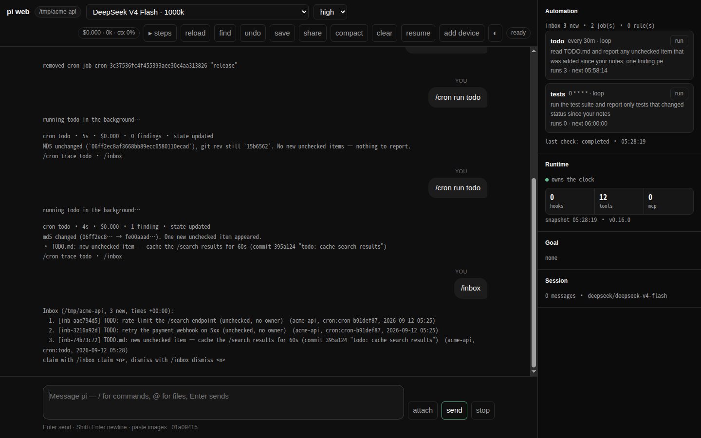

# pi-loops

[English](README.md) · 中文

给 [pi](https://github.com/earendil-works/pi) 的自动化层，做成一个 extension：cron 和有记忆的 loop、一个分诊用的 inbox、动态 trigger 与 MCP 推送通知、生命周期 hooks。pi 的代码一行没动。



一个 loop 醒来时带着上次留下的笔记，在干净上下文的子代理里干完活，把 finding 归档；你想看的时候去看，值得认真处理的那条再 claim 成真正的一轮。加上 `--verify`，第二个对抗式子代理会先把每条 finding 挑一遍，留下的才到你面前。关掉 pi 之后，这些照样跑。

## 为什么需要它

有些活本来就该在没人看着的时候干完：夜里新开的 issue、某个依赖冒出来的 CVE、main 上突然开始挂的那个测试。这些 agent 都做得了，但得你坐下来开口要——于是「开口要」本身成了那份活。

而顺手能想到的两种自动化，产出都落错了地方：定时把 prompt 塞进你正在进行的会话，等于拿你此刻不想看的东西打断你；写进日志，则是写进一个没人翻的文件。

> "Stop prompting the agent. Build loops that prompt the agent for you."
> — Addy Osmani, *Loop Engineering*

所以这些活挪进一个永远不碰你对话的子代理里跑，跑出来的东西进 inbox。

## 你要敲的命令

```bash
pi-loops                              # 开一个会话——本地开浏览器，ssh 里开终端
pi-loops --tui                        # 猜错时强制终端
pi-loops --continue                   # 接着这个目录里最新的那个会话
pi-loops sessions [--all]             # 这个目录（或整台机器）记下的会话
pi-loops inspect <file>               # 别人发来的 .pisession，导入前先看清里面是什么
pi-loops upgrade                      # 装最新的发布版，当初从哪装就从哪装
pi-loops host status                  # 看一眼没有 pi 开着时在跑的自动化
```

上面这几条都得先有 `pi-loops` 这个命令，它在 [上手](#上手) 里装。其余都是会话里的斜杠命令（`/cron`、`/inbox`、`/triggers`、`/goal`），装上扩展重启 pi 就能用。

## 上手

### 1. 先确认前提

Node ≥ 22.6（pi 直接加载 TypeScript 源码），pi ≥ 0.84.3（实际在 0.85 上测；更老的 pi 会在加载时被明确拒绝，报一句写明所需版本的话，而不是一个缺导出的链接错误），以及**一个真的能说上话的 provider**——先跑一次 `pi`，发一句，确认有回答。pi-loops 会在你不看着的时候替你跑子代理；凭据没配好，别等到第二天早上看见空 inbox 才知道。

pi-loops 自己没有任何运行时依赖。

### 2. 装上

```bash
pi install npm:@alphacoder-v0/pi-loops                      # 从 npm 装，跟着新版本走
pi install git:github.com/alphacoder-v0/pi-loops@v0.18.0    # 或者从 GitHub 装，钉住一个 tag
pi install /path/to/pi-loops                                # 或者本地检出；本仓库里就是 pi install .
```

**几种装法挑一种，不要装两份。** 两份副本注册同名工具，pi 会拒绝加载第二份并直接退出（`Tool "cron_create" conflicts with …`）。如果你在改这份代码，留本地检出那份。

重启 pi，装到这里就够了——那四个斜杠命令现在就能用。下面这步只跟 `pi-loops` 这个命令有关：浏览器窗口和几个 shell 子命令靠它，不要浏览器窗口可以先跳过。

`pi install` 把包放在 pi 自己的托管目录里、**不进 `PATH`**，所以此刻 `pi-loops` 这个命令还不存在——这恰好是 `install-launcher` 唯一没法替自己做的事。两条路随便走一条：

```text
/pi-loops install-launcher                         # 在 pi 里面，扩展本来就加载着
```

```bash
# 或者在 shell 里，进到 pi 装包的那个目录
cd ~/.pi/agent/npm/node_modules/@alphacoder-v0/pi-loops    # 从 npm 装的
cd ~/.pi/agent/git/github.com/alphacoder-v0/pi-loops       # 从 GitHub 装的
node src/cli-entry.mjs install-launcher
```

两条都会往 `~/.local/bin`（或其它已在 `PATH` 里的目录，用 `--dir` 指定）写一个启动器。之后 `pi-loops` 在任何目录都能用。

### 3. 开一个会话

```bash
pi-loops                                           # 开会话，窗口按环境自己选
```

本地终端里开浏览器前端；ssh 里或者根本没有终端时，开 pi 本身——在对面机器上弹浏览器对谁都没用。猜错了就用 `--web` / `--tui` 指定，`--continue` 接着上次，其余参数原样交给 pi：

```bash
pi-loops --tui                                     # 终端版
pi-loops --continue                                # 这个目录里最新的那个会话
pi-loops --model anthropic/claude-opus-5 -e .
```

两个窗口都是完整的 pi 会话（浏览器那个是 `pi --mode rpc` 加一个网页），会话文件、`--resume`、模型、工具、扩展完全一样。细节见 [docs/cli.md](docs/cli.md)，浏览器前端必须保住的能力清单见 [docs/web-ui-parity.md](docs/web-ui-parity.md)。

上次选的模型和思考等级它记着（存在 `ui.json`），下一个会话直接从它开始——`--continue` / `--resume` 除外，那种会话自己带着模型。

重新开始不用回终端：**clear** 开一个新会话，**resume** 回到这个项目里早先的某个会话，**compact** 压缩当前上下文并告诉你压成了多少。三个都是按钮，也都可以在输入框里直接敲（`/clear` 或 `/new`、`/resume`、`/compact 保住 API 的形状`）。谁都不删东西：离开的那个会话就是磁盘上的一个文件，`resume` 里列的就是它，标题是当时说的第一句话。

浏览器那个地址默认是 **`http://127.0.0.1:4173/`**（`--port` 可以换）：端口不随机，token 存在文件里，所以这个地址明天还是它，可以直接收藏。第一次访问会留一个 cookie，之后再也看不到 token。已经开着一个时再敲 `pi-loops`，它会把已经在跑的那个打开给你。只有你自己用的机器上，`--no-auth` 可以把这层也去掉。

手机上用：最好的路是 `tailscale serve --bg 4173`——服务器仍然只绑 127.0.0.1，TLS 和身份都交给 tailnet，手机打开 `https://<机器>.<tailnet>.ts.net/`。同一个 wifi 里也可以 `pi-loops --host 0.0.0.0`（这时候再加 `--no-auth`，它当场拒绝）。手机第一次进什么都不用输：在已经登录的浏览器里点 **add device**，拿手机扫那个二维码就进去了，之后一直是登录状态（不想扫也可以输下面那六位数）。加到主屏幕会以独立窗口打开（有 manifest，没有 service worker）。

### 4. 第一个 loop

```text
/cron add --stateful "0 9 * * *" 看一下这个仓库的 GitHub issues，报告自上次以来新开的和新关的
```

每天早上一个干净上下文的子代理带着上次写的笔记跑一遍，回复末尾给出 `<loop-state>…</loop-state>`（留给明天的笔记）和 `<inbox>一行 finding</inbox>`：状态写进一个 Markdown 文件，finding 进 inbox，你的对话一个字都不动。下面是一个盯着 TODO 文件的 loop 相隔半小时的两次运行，第一次：

```text
cron todo · 5s · $0.000 · 0 findings · state updated
MD5 unchanged (`06ff2ec8af3668bb89ecc6580110ecad`), git rev still `15b6562`. No new unchecked items — nothing to report.
/cron trace todo · /inbox
```

中间提交了一次之后，第二次：

```text
cron todo · 4s · $0.000 · 1 finding · state updated
md5 changed (06ff2ec8… → fe00aaad…). One new unchecked item appeared.
• TODO.md: new unchecked item — cache the /search results for 60s (commit 395a124 "todo: cache search results")
/cron trace todo · /inbox
```

第一次什么都没发现，于是什么都没说；第二次只注意到一处变化，也只报了那一处。这就是「两次运行之间留笔记」换来的东西——没有它，每天早上报的都是整份文件，你周四就不看了。它们归档的东西在 inbox 里等着，每行都写明项目、来自哪个 loop、什么时候：

```text
/inbox
Inbox (acme-api, 3 new, times +00:00):
  1. [inb-aae794d5] TODO: rate-limit the /search endpoint  (acme-api, cron:todo, 2026-09-12 05:25)
  2. [inb-74b73c72] TODO.md: new unchecked item — cache the /search results for 60s  (acme-api, cron:todo, 2026-09-12 05:28)
claim with /inbox claim <n>, dismiss with /inbox dismiss <n>
```

```text
/cron                                              # 这个项目里有什么、下次什么时候跑
/cron run 1                                        # 不用等到早上九点，现在就跑一次看看
/inbox claim 1                                     # 把第 1 条作为真实的一轮交给 agent
/inbox dismiss 2                                   # 不感兴趣
```

### 5. 让它整夜跑之前

```text
/cron cost                                         # 今天自动化花了多少
```

在 `~/.pi/agent/loops/config.toml` 里先设个上限再依赖它：

```toml
[limits]
daily_budget_usd = 5.0
```

最后一个 pi 退出时，无头宿主会接手时钟，所以早上九点那次照跑（`/cron host`、`pi-loops host status`）。不想要就在同一个文件里写 `[host] auto = false`。

## 升级

```bash
pi-loops upgrade                                   # 装最新的发布版
pi-loops upgrade --check                           # 只看看有没有新的
```

它从这份副本的来源仓库读 release tag，和你正在跑的版本比，然后按这份副本当初的装法装最新那个。

从 GitHub 装的，只能靠它换版本：`pi update --extensions` **有意**不做这件事，pi 钉住你写的那个 ref，并且只把克隆对齐到**那个** ref。换版本是另一个决定，而做这个决定得先知道哪个 tag 最新——本该命令替你查，不是你查完再手打回来。从 npm 装、没写版本号的，`pi update --extensions` 本来就会升，`upgrade` 升完也保持不钉版本；钉了精确版本的，升完仍然钉着，钉到新版本上。

装完重启 pi（或者再跑一次 `pi-loops`）就生效。启动器不用重装：pi 放包的路径不随版本变——`~/.pi/agent/npm/node_modules/<包名>` 或 `~/.pi/agent/git/<host>/<owner>/<repo>`。

版本就是 GitHub 上的 tag，同一个版本号也发到 npm，每个 tag 里有什么见 [CHANGELOG.md](CHANGELOG.md)。

## 卸载

```bash
pi remove npm:@alphacoder-v0/pi-loops              # 当初怎么装的就怎么删：npm: 包名、git: ref 或检出路径
pi remove git:github.com/alphacoder-v0/pi-loops
pi -e /path/to/pi-loops                            # 或者：只在这次启动试用，什么都不装
pi update --extensions                             # 对齐已安装的包
```

数据留在 `~/.pi/agent/loops`，想清就删目录。

包里附带一个 skill（`skills/pi-loops`），让 agent 知道什么时候该用 `cron_create`、`new_trigger` 和 inbox。

[docs/](docs/) 里分成 loops、triggers、goal、mcp、hooks、session-archive、cli、configuration、design、troubleshooting、web-ui-parity 几篇；变更记录在 [CHANGELOG.md](CHANGELOG.md)，贡献者说明在 [AGENTS.md](AGENTS.md)。

## 值得偷的 loop

```text
/cron add --stateful --name main-watch "0 9 * * *" 读一下 main 上自笔记里那个 revision 之后的提交，动到公开 API 的报出来，并把新的 head revision 记进笔记
```

笔记里存一个 revision，下次运行拿它当起点，只有差出来的那一截值得占一条 inbox。

```text
/cron add --stateful --name deps "0 8 * * 1" 跑 npm audit，只报笔记里还没有的 advisory id；报过的 id 追加进那个列表
```

每周一早上跑一次。watermark 不在别处，就在 loop 自己的笔记里——一份 id 列表，纯 Markdown，`/cron state deps` 能看能改。同一条 advisory 报过一次就不再报。

```text
/cron add --verify --name ci every 30m 跑测试套件，只报相对笔记状态发生变化的测试
```

`--verify` 隐含 `--stateful`，在 findings 和你之间加一层子代理。flaky 测试正该拦在这一层。剔掉它的理由在 `/cron trace ci 1 checker` 里。

```text
/new-trigger 当 ~/build.done 出现的时候，跑 cargo test 并把结果给我看
```

不看钟，看条件。子代理每 `[triggers] poll_interval_secs`（默认 600 秒）回来看一眼，条件成立就动手——默认只触发一次，要重复得明说。

```text
/cron add in 45m 提醒我看一下这次部署
```

这条没有 `--stateful`，所以它是个普通任务，不是 loop。45 分钟后 prompt 直接落进**当前这个对话**，agent 就在这儿回你，不进 inbox。提醒该在对话里，夜里的报告不该。

```text
/cron add --stateful --cwd /srv/acme-api --model openai/gpt-5.5 "0 7 * * *" 总结这个仓库自笔记以来的变化
```

任务在创建时就记下自己的目录和模型，所以它不绑在敲出它的那个窗口上。`--cwd` 让它在另一个检出里跑——绝对路径，或相对当前项目；这里没有 shell，`~` 不会展开。`--model` 把模型钉死，`/cron set <ref> --model -` 解钉。

### 不用自己写的：recipe

```text
/recipe                    有哪些打包好的 recipe，这个项目装了哪些
/recipe add issue-loop     把 issue tracker 跑成状态机：分诊成 agent brief、在 worktree 里实现、开 PR；推进和合并留给人
/recipe add autoresearch   按你写的研究合同每次跑一个实验，账本记下每次尝试，只凭 held-out 数据提议晋升
```

一个 recipe 是一组 loop 加上它们各自每次 run 都会读的 playbook。安装只问一个问题（自治级别
`report` / `propose` / `act`）、确认一次（每个要写的文件、setup 脚本全文、每一行 `/cron add`），
playbook 拷到 `.agents/skills/<name>/`，通过 `.git/info/exclude` 排除在仓库之外——你随时可以改它，
下一次 run 就照改后的做。见 [docs/recipes.md](docs/recipes.md)。

## 用法

会话里的命令分几摊：`/cron` 管任务，`/inbox` 管分诊，`/goal` 管「做到什么算完」，`/triggers` 管不看钟的那些规则，`/session-share` 把这次会话脱敏后发出去。

```text
/cron add "*/30 * * * *" summarize the repo state               # 普通任务：到点结果出现在当前对话
/cron add --stateful "0 9 * * *" check the GitHub issues of this repo and report anything new or newly closed since the last run
                                                                # loop：子代理 + 跨轮笔记 + findings 进 /inbox
/cron add --stateful --name ci every 30m run the test suite; only report tests that changed status since your notes
/cron add in 10m 提醒我看一下测试结果                           # 会话级闹钟
/cron  ·  /cron list|ls|status      本项目的任务，[stateful] 标记；/cron all 看整台机器
/cron enable|resume|disable|pause|remove <n|id|name>
/cron set <ref> …                   改已有任务而不换 id（笔记因此留着）：--prompt、--schedule，
                                    以及 --model、--thinking、--timeout、--name、--host 这几个钉子（`-` 解掉）
/cron run 1                         立刻跑一次（once 跑完即删，every 的间隔从现在重算，cron 的下次不变；停用的普通任务会被拒绝）
/cron state ci                      loop 的笔记（状态脊柱）
/cron runs [ci]                     最近运行，最新在前
/cron trace ci 2                    第 2 新那次运行的 transcript：prompt、工具调用、结果、回复
/cron scheduler                     谁在走时间、有哪些 run 在跑（`/cron status` 是 `/cron` 的别名）
/cron cost [today|7d|all]           自动化花了多少，按任务分，对照 [limits] daily_budget_usd
/cron disable --all                 本项目全停（--all-projects 停整台机器）；/cron clear <ref> 清掉死进程留下的 running 标记
/cron gc                            清掉会话已消失的任务（本项目；--all 才跨项目）
/cron host [start|stop]             最后一个 pi 退出后接手时钟的无头宿主
/cron snapshot                      把「只有这个进程知道的状态」写进会话：哪些 MCP 连上了、暴露了什么工具、
                                    当前 active tools、hooks、谁拥有时钟。给非终端的前端读的

/goal 测试全部通过并且改动已提交                                # 每轮结束由评估器判断是否达成，未达成就送回去继续做（最多 8 次）
/goal  ·  /goal pause|resume|clear                              # 看状态 / 暂停 / 恢复 / 清除

/triggers run <id>                  立刻检查某条动态规则，不等它的轮询时隙
/session-share [--public]           把这次会话的 transcript 脱敏后传成 GitHub gist（走 gh），
                                    上传前先告诉你里面有什么、遮掉了几处、本地副本在哪

/inbox                              本项目的新 findings（每行标出项目；`--all` 看全部项目，与 /cron、/triggers 同一套作用域）
/inbox claim 1                      标记 claimed，并把它作为一个真实 user turn 交给主会话的 agent
/inbox dismiss 2  ·  /inbox clear  ·  /inbox all
```

`/crontab` 和 `/loop` 是 `/cron` 的别名。

调度表达式有四种写法：

- **5 段 cron**：本地时间，支持 `*/n`、范围、列表、`mon-fri`、`jan`。
- **别名**：`hourly` / `every hour` / `daily` / `once a day` / `weekly` / `每小时` / `每天` / `每周`，daily 与 weekly 落在本地 09:00。crontab 那套 `@hourly` / `@daily` / `@weekly` / `@monthly` 也认——注意 `@daily` 是午夜，不是 09:00。
- **间隔**：`every 30m`、`every 24h`。
- **只跑一次**：`in 10m`、`at 2026-09-08T18:00`。

`/cron add` 的额外 flags：`--name`、`--cwd`、`--model provider/id`、`--thinking level`、`--tools a,b`、`--timeout 20m`、`--catchup` / `--no-catchup`、`--verify`、`--checker-model provider/id`，外加 `--loop`（`--stateful` 的同义词）和 `--inject`（反过来，明确要一个普通注入任务）。

自然语言也行：注册了 `cron_create`（带 `stateful`/`verify` 参数）、`cron_list`、`cron_remove`（两步：先 `confirm=false` 预览，用户确认后再 `confirm=true`）、`set_cron_job_state`（启用会弹确认；禁用本项目的任务直接生效，禁用别的项目的也要确认）四个工具，「每小时看一下 CI，记住上次看到的，只报变化」会让 agent 自己建一个 stateful 任务。

### 时间用的是哪个钟

**全都是这台机器的系统时间。** cron 表达式按本地时区匹配——`0 9 * * *` 是**机器所在地**的早上九点，不是 09:00 UTC——没有 per-job 时区。换机器、改 `TZ`，任务跟着走。

写进文件的时间戳也是同一个钟，后面缀着偏移，读的人不用猜：

```json
{"startedAt": "2026-09-11T20:37:59.405+08:00", "finishedAt": "2026-09-11T20:38:12.880+08:00"}
```

（这是 `+08:00` 的机器写出来的；你那台写你那台的。）它和 `2026-09-11T12:37:59.405Z` 是同一时刻，解析得了一个的就解析得了另一个——包括旧版本写的，所以不需要迁移。差别在于：打开 `runs.jsonl` 看到的是你当时坐在电脑前的那个钟点，而且和 `/cron` 那行的 `next` 对得上。`/cron` 与 `/inbox` 在标题里写明偏移；离开这块屏幕的时间戳（进子代理 prompt、进模型读的工具结果）自己带着偏移。

只有两样仍然是 UTC，因为它们都不是给人读的时间：session 文件的**文件名**（装不下偏移里的 `+` 和 `:`），以及 pi 自己的 session header（格式由 pi 定）。

**夏令时**（实测，`America/New_York`，2026）：

| | 会发生什么 |
|---|---|
| 3 月 8 日前跳，`0 2 * * *` | 那天没有 02:00，**当天不跑**，第二天照常 |
| 11 月 1 日回拨，`0 1 * * *` | 01:00 出现两次，**跑两次** |

Vixie cron 对这两种都有特例处理，pi-loops 没有：它匹配墙上的钟，钟是什么就是什么。**必须一天一次且不能两次的任务，用 `every 24h`**——它算流逝时间，不看日历。

**`at` 的坑**（是 JavaScript 的规则，不是我们的选择）：

```text
at 2026-09-08T18:00    → 本地 18:00
at 2026-09-08T18:00Z   → UTC 18:00
at 2026-09-08          → UTC 零点   ← 只给日期按 UTC，在北京就是当天 08:00
```

要表示时间就把时间写出来。另外 `in 10m` / `at` 在**创建那一刻**就被算成一个绝对时刻存下来，之后改时区不影响它；`every 30m` 是纯间隔，和时区、夏令时都无关。

**跨机器的 loop**：没有 `host` 的任务会在任何共享这个 `$HOME` 的机器上跑——`/cron set <ref> --host -` 干的就是把 `host` 这个键从任务上摘掉。stateful loop 的笔记是模型自己写的自由文本，里面常有 watermark（「看到这里为止」），所以 prompt 会要求模型写时间时带上偏移。0.14.1 之前写下的笔记没有这个保障，跨时区又带 watermark 的 loop 值得用 `/cron state <id>` 看一眼。

## Maker/checker：先质疑每条 finding，再给你看

```text
/cron add --stateful --verify "0 9 * * *" check the repo issues and report anything new since the last run
/cron add --verify --checker-model openai/gpt-5.5 every 30m …        # --verify 隐含 --stateful；checker 可换模型
/cron trace ci 1 checker                                              # 看最近一轮 checker 的 transcript 与被剔除的条目
```

maker 子代理照常跑，产出 `<inbox>` findings。任务带 `verify` 时，这些 findings 不直接进 inbox，先交给第二个干净上下文的 checker 子代理。

checker 拿到任务目标、maker 的笔记和编号好的 findings，prompt 明着要它**对抗式**地核：假定每条都可能错、过期、重复或者根本不值得看，自己动工具验，再对每条给 `<verdict n="i">keep|drop — 理由</verdict>`，措辞不对就用 `<rewrite n="i">…</rewrite>` 改。

- **checker 自己挂了怎么办？** 失败或超时就 fail-open：findings 全部进 inbox，标记未核实，卡片里注明。坏掉的 checker 不能让 loop 失声。
- 只有 keep 的进 inbox，`/inbox` 里带 `✓`，claim 时把 checker 的理由一并交给主 agent。
- drop 的连理由记进 run log，运行卡片里以 `✗` 列出，`/cron runs` 显示 `checker kept k/n`。
- 没给判定的条目也进 inbox，只是不带 `✓`（unreviewed）。
- 笔记是 maker 的，checker 只裁决输出——状态脊柱它一个字都不碰。
- 两份 transcript 一起留在 `sessions/<id>/`。

真机验证：让 maker 故意夹一条「src/does-not-exist.ts 存在且有 900 行」，checker 用 `ls` 核实后把它剔除，理由写 `deliberately false per loop goal`，另外两条真实 finding 带 ✓ 进了 inbox。

## Session 归档：连同自动化一起带走

pi 内置的 `/export` 只导 HTML/JSONL 对话，`/import` 只导回对话——一个会话真正的一半留在原地。这里做成 `/session-export` 与 `/session-import`（pi 已占用 `/session`），格式是 `.pisession`：对话、这个项目的任务与规则、以及每个 loop 攒下的笔记，一起打包带走。

```text
/session-export [path] [--exclude-triggers]          默认 ./pi-session-<id前16位>.pisession
/session-import <path> [--activate-triggers=on|off] [--cwd <dir>] [--resume]
```

```text
backup.pisession                 无压缩 ustar，0600，拒绝覆盖已有文件
  manifest.json                  schema / 时间 / pi 与 pi-loops 版本 / 来源 / session.jsonl 的 sha256 / 敏感性声明
  session.jsonl                  pi 的 session 文件原样
  sidecars/cron.json             本项目的 cron 任务
  sidecars/triggers.json         本项目的 trigger 规则（--exclude-triggers 可去掉）
  loops/<job-id>.md              每个 stateful 任务的笔记（状态脊柱）
```

导入的时候会重写这些：

- session 换新 id，cwd 改成目标目录，header 里记下 `importedFrom` 来源。
- 任务和规则默认全部 disabled。`--activate-triggers=on` 会弹一次确认，问你要不要把源会话里原本 enabled 的那些重新打开。
- 运行标记、错误、重叠计数清零。
- id 撞上本机已有的就重新生成，loop 状态文件跟着新 id 走。
- 非 stateful 任务重新绑定到导入的 session。

`--resume` 直接切到导入的会话，否则给出 `pi --session <path>`。校验有四道：manifest schema、session.jsonl 校验和、路径穿越、各部分大小上限（session 50 MiB、sidecar 2 MiB）。

真机验证：导出后 `tar tf` 看到四个成员；同机导入时 job id 冲突被重生成，`loops/*.md` 内容出现在新 id 的状态文件里，确认后任务恢复 enabled。

## Trigger 与 notification

```text
/new-trigger when ~/build.done exists, run cargo test and show me the result   # 自然语言，agent 调 new_trigger 建规则
/new-trigger 当 $HOME/helloworld 存在的时候，打印它的内容                          # 中文分隔词同样支持
/triggers                    status：规则统计、轮询器归属、上次检查结果、推送源数量
/triggers rules [--all]      规则列表：id [enabled, fire_once|repeat, audit_only|promote_to_chat, fired_at] when … -> …
/triggers sources            trigger 源：本地轮询器 + 每个 MCP 服务器的连接状态、queued/dropped/deduped、最近错误
/triggers enable|disable|remove <id>  ·  /triggers remove --all（本项目）| --all-projects（本机全部）
/triggers running  ·  /triggers abort <trace>|--all
/triggers audit [N]          最近 N 条 audit：accepted / deduped / running / completed / failed / promoted
```

语义：
- 规则默认 **fire once**，匹配后自动 disabled 并记 `fired_at`；`/triggers enable` 会复位。要重复触发得明确要求，agent 会传 `fire_once=false`。
- 只要还有 enabled 的规则，每 `poll_interval_secs`（默认 600）就起一个干净上下文的子代理，把全部规则和事件 JSON 交给它。它自己用工具查文件、查命令输出、查时间，命中就执行那条 action，回复里带 `matched dyn-…`；没命中就回固定的一句 `no dynamic trigger rule matched`。
- 结果默认只落在 TUI 卡片和 audit 里；规则带 `promote_to_chat` 时，它以 `[Trigger <trace_id>] …` 开头插进主对话，后面的 turn 看得见。
- 5 分钟 dedup 窗口，`listChanged` 类通知用稳定 key 折叠成最新一条，自定义通知必须带 `_meta.pi_dedup_key`，否则在源头丢弃并计数。
- 自然语言里出现「每小时 / daily / cron / 定时任务」之类时，`new_trigger` 会拒绝并让 agent 改用 `cron_create`。
- 工具：`new_trigger`（condition / action / spec / fire_once / promote_to_chat）、`list_triggers`、`remove_trigger`（id | all）、`set_trigger_state`，描述与返回文本固定。建规则、删规则、重新启用自动化这三件事都要你点头：工具把原因摆出来等你确认，没有 UI 可点的场合（子会话、无头宿主）一律拒绝。
- 规则是机器全局的（带 cwd），`/triggers rules` 默认只看本项目；子代理进程里不注册这些工具，所以一条 trigger 的动作造不出新的 trigger。
- 轮询间隔：`--trigger-poll-secs 60` 或 `config.toml` 的 `[triggers] poll_interval_secs`。

### MCP 推送作为 trigger 源

pi 没有内置 MCP 客户端，这里自带了一个只消费通知的最小实现。配置文件 `~/.pi/agent/loops/mcp.toml`，项目级 `<repo>/.pi/mcp.toml` 同名覆盖（需要该项目已被 pi 信任）：

```toml
[[server]]
name = "filesystem"                       # kind 默认 stdio
command = "npx"
args = ["-y", "@modelcontextprotocol/server-filesystem", "/path"]

[[server]]
name = "hub"
kind = "streamable_http"
endpoint = "https://example.com/mcp"      # 必须 https，127.0.0.1 除外
auth = { kind = "bearer", token_keychain_ref = "PI_MCP_TOKEN_HUB" }  # token 不写在文件里：查 pi 的凭据库，或 PI_MCP_TOKEN_* 前缀的环境变量
request_timeout_ms = 30000                # 默认 30s
sse_idle_timeout_ms = 60000               # 事件流静默超过此值就重连，默认 60s
body_cap_bytes = 1048576                  # 响应体上限，默认 1 MB
reconnect = { initial_ms = 500, max_ms = 30000, max_attempts = 10 }   # 500ms 起指数退避到 30s，这里写的是试 10 次；不写 max_attempts 则默认 20 次，之后放弃，等 pi 重启
inject_summary = true                     # 摘要直接进主对话，不起子代理、不花钱
# inject_and_run = true                   # 摘要进主对话并跑一个 turn，让主 agent 响应
```

语义：
- 通知 → trigger 的映射：`tools/resources/prompts listChanged` 用稳定 key 折叠成最新一条；`resources/updated` 按 uri 分 key；自定义通知必须带 `_meta.pi_dedup_key`，否则在源头丢弃并计数，`/triggers sources` 显示 `dropped custom notification "…": missing …`。
- 摘要里只有方法名，和几个脱敏过、长度封了顶的字段（`notifications/resources/updated uri=…`、自定义通知的 `_meta.pi_summary` 截到 200 字）。原始 params 绝不写进 audit 或对话。
- 逐台服务器校验：一台配置错只报 `mcp server '<name>' failed: …`，其它照常连接。stdio 不得带 endpoint/auth；超时、上限、重连延迟必须为正；auth 只支持 bearer。
- streamable_http：POST `initialize` 与 `initialized`，然后长连 GET 事件流；POST 响应本身是 SSE 时也解析；断流带 `Last-Event-ID` 续传。
- 不加任何 inject 标记的服务器，其通知交给动态规则子代理评估。

stdio 服务器崩溃后自动重连；`Mcp-Session-Id` 会话头；服务器发来的 request 都回得上（`ping` 回 `{}`，其它回 method-not-found）；stdio 可加 `env` 表。

### MCP 工具注册给 agent

`mcp.toml` 里每台服务器握完手就 `tools/list`，把工具逐个 `pi.registerTool` 给 agent：名字用服务器给的原名（和已有工具撞名就加 `<server>_` 前缀），参数 schema 原样透传，`tools/call` 的 text / image / resource 内容映射成 pi 的工具结果，`isError` 变成工具错误，用户中断时给服务器发 `notifications/cancelled`。

连接是每个 pi 进程自己的事——工具得在手边才用得上，子代理也一样。推送通知则是交互式 pi 各自收各自的，机器级的 `dedup.json` 保证同一条只处理一次；子代理不注册通知钩子，收不到推送，万一还有触发跑到 hop ≥ 1，运行时把它记成 `cycle_suppressed`。

`/triggers sources` 显示每台服务器注册了哪些工具。

真机验证：agent 调假服务器的 `echo`，拿到了返回。

### 生命周期 hooks

`~/.pi/agent/loops/hooks.toml`：

- 事件：`agent_start/agent_end/turn_start/turn_end/message_start/message_update/message_end/tool_start/tool_update/tool_end/compaction`，外加一对 **`run_start` / `run_end`**——定时运行发这一对，交互式 pi 和无头宿主都发。

  有人值守时，一次定时运行本身就是对话里的一轮，`agent_*` 够用。无人值守时没有对话可言，宿主里一个 `agent_*` 都不会发，于是最该让外部系统知道的那类活，反倒成了 hooks 看不见的活。硬把定时运行也算进 `agent_*`？那你为自己的轮次写的规则会突然替自动化触发。

  `run_end` 的 payload 带 `run_ok` / `run_findings` / `run_error` / `run_cost_usd`，所以「loop 挂了通知我」是 `[ "$PI_RUN_OK" = false ]`，不是拿摘要做字符串匹配。
- 字段：`command`、`webhook`（可同时用，先命令后 webhook）、`timeout_ms`（默认 5000）、`enabled`、`cwd = project|loops|home`、`on_failure = warn|ignore`、`tool` 过滤、`[hook.headers]`。
- payload 去两个地方：webhook body，和 `$PI_HOOK_PAYLOAD` 指的那个文件。每次都是同一组键，这次用不上的写 `null`：`event`、`session_id`、`cwd`、`model_provider`、`model_id`、`thinking_level`、`source`，消息的 `message_kind`、`message_summary`、`assistant_event`，工具的 `tool_call_id`、`tool_name`、`tool_is_error`、`tool_args`、`tool_result_summary`，压缩的 `compaction_trigger`、`compaction_tokens_before`、`compaction_summary`、`compaction_failed`，定时运行的 `run_job`、`run_id`、`run_ok`、`run_findings`、`run_error`、`run_cost_usd`。摘要截到 2000 字符，thinking / tool call / image 用占位符。不脱敏——这是给你自己的脚本看的。
- 环境变量用 `PI_*` 前缀，只在有值时设置。
- 单条规则写错只跳过那条并提示，其它照常加载。同一事件的规则按文件顺序串行执行，不阻塞 agent。
- 超时或 Ctrl-C 时杀掉 hook 的整棵进程树，不只是 `sh`。
- 项目级 `<repo>/.pi/hooks.toml` 默认忽略；用户 `hooks.toml` 顶层写 `allow_project_hooks = true`、或 `config.toml` 同名键、或 `PI_ALLOW_PROJECT_HOOKS=1`（`true` 也算，其它值都算关）才启用。**在无头宿主里还额外要求 pi 对那个任务的 cwd 有精确的信任记录**——`allow_project_hooks` 是对「你会打开的项目」的表态，不是对「模型顺手指过去的目录」的表态。
- hook 打到 stdout 的东西写进本进程日志（`logs/pi-<pid>.log`，宿主写 `host.log`），截到 4000 字符——「打印点东西再去看」这个最常用的调试手段现在是通的。
- 子代理进程里不触发 hooks，只有你交互的那个 pi 触发。

## 子代理每次收到的 prompt

```text
You are running the recurring loop "ci" (current run started <这次运行开始的时间，跑它那台机器的钟，带那台机器的偏移>; write any time in your notes with its offset, as that one has). This is a background run: nobody is watching, and your final reply is parsed by a program.

[loop-state] (your notes from the previous run of this recurring job)
<state 文件内容，或 (first run)>
[/loop-state]

<你的 prompt>

Output protocol (mandatory):
- End your reply with <loop-state>notes for the next run</loop-state> — it REPLACES the saved state; keep it under 2000 characters and make it the information your next run needs (baselines, ids already seen, watermarks).
- For each finding a human should act on, emit <inbox>one concise line</inbox>. No findings → no inbox tags; do not invent work.
- Keep everything after the last tool call short so the tags are not truncated.
```

## 它是怎么搭起来的

| 机制 | 怎么实现的 | 存放位置 |
|---|---|---|
| **状态脊柱** — 每个 loop 一份 ≤2000 字符的笔记，run N+1 读到 run N 写的 | `<loop-state>` 标签解析后写入 Markdown，下次运行拼进 prompt 头部 | `~/.pi/agent/loops/state/<id>.md` |
| **maker/checker** | `--verify`：第二个对抗式子代理逐条核实 findings，drop 的不进 inbox | `runs.jsonl` 的 `checker` 字段 |
| **路由层** — 产出既不打断你也不沉进日志 | `<inbox>` 标签 → JSONL 追加，`new → claimed/dismissed` 生命周期，状态栏 `Inbox: N new` 角标；条目 id `inb-<32hex>`、来源 `cron:<id或name>`、`/inbox` 与 `/inbox all` 的行格式、错误措辞都固定下来，已核实的多一个 `✓` 标记 | `~/.pi/agent/loops/inbox.jsonl` |
| stateful job 走 SubAgent、永不碰主对话 | 同进程子会话（pi SDK），干净上下文，共享父会话的 MCP 客户端、扩展、model/thinking；完整 transcript 保留在 `sessions/<id>/`，`/cron trace` 可看 | `~/.pi/agent/loops/sessions/<id>/*.jsonl` |
| trigger 的产出看得见、可追溯 | 每次运行结束在 transcript 里落一张卡片（耗时、成本、findings、摘要），run log 记退出码与用量 | `runs.jsonl` |
| 预览与 audit 一律脱敏 | `src/redact.ts` 一套 redactor，列表、卡片、run log、trace 全部过一遍 | — |
| 普通 cron 走 inject-and-run | 不加 `--stateful` 的任务到点用 `pi.sendUserMessage` 注入创建它的会话，消息带 `[Trigger <trace>] ` 前缀（空闲直接发，忙则 followUp 排队） | — |
| 每次 add / enable / disable / remove 写 `cron_control_plane` audit（含 actor 是 slash 还是 tool） | 同名 custom entry 写进 session（不进 LLM 上下文） | session 文件 |
| cron 运行也走 trigger runtime | `/triggers running` 看得见、`/triggers abort` 可中止、`/triggers audit` 有记录；运行 id 就是 trace id | `triggers-audit.jsonl` |
| 输出协议是纯文本不是 API | 同一套 prompt 措辞，任何能听指令的模型都能跑 | `src/protocol.ts` |
| 标签解析永不让 run 失败 | 标签缺失/截断 → 状态不动、inbox 不进，run 照样记完成 | — |
| 一切有界 | state ≤ 2000 字符，finding ≤ 500 字符，每 run 最多 16 条，prompt ≤ 8 KB | — |

## 自动化要活过开它的那个窗口

定时任务值不值得信，取决于你关掉编辑器之后会发生什么。所以这里把「pi 重启过」当成常态：

1. **任务是机器全局的（按主机）**，存在 `~/.pi/agent/loops/jobs.json`，不绑会话、不绑目录（每个任务记住自己的 `cwd` 与 `host`，子代理在那里跑；共享 $HOME 的另一台机器会忽略它）。任何目录里打开的任何 pi 都能看到并执行 stateful 任务；普通任务因为要注入对话，只在创建它的那个会话里触发（`--resume` 回来就继续），会话没了，leader 会把它停用，`/cron gc` 清掉；子代理创建的普通任务归它所服务的那个父会话。
2. **loop 归本机唯一的 leader 跑；动态检查归「开在那个项目里的那个 pi」跑。** `scheduler.<host>.json` 里放 pid 加心跳，30 秒一 tick；leader 退出或者崩了，其它 pi 在下一 tick 接手。

   每个进程每 tick 往 `presence/` 登记自己的 pid、会话和 cwd。一个项目的规则检查和推送评估，就交给开在那个项目里的 pi——优先创建规则的那个会话，其次 pid 最小的那个——所以 promote_to_chat 一定落在对的对话里。项目里一个 pi 都没开，才轮到 leader 代跑，结果进 inbox。

   轮询间隔看共享的 `polls.json`，全机一份，交接不会重复检查。
3. **loop 错过的 tick 默认补发一次**（多次错过折叠成一次，就像 systemd `Persistent=true`），`--no-catchup` 关掉。普通注入任务反过来，默认不补，要补得写 `--catchup`：它是往对话里插一句话的，迟到的提醒不如不提醒。
4. **没有过期时间。** 任务只在你 `/cron remove` 时消失。
5. **有 run log 和完整 transcript。** `runs.jsonl` 记每次运行的退出码、耗时、成本、finding 数、有没有更新状态；子代理的 session 文件每个 loop 保留最近 20 份，`/cron trace <job> [k]` 直接看它调了什么工具、看到了什么，`pi --session <文件>` 可以整个接管回放。

子代理在父进程内运行：共享父进程活着的 MCP 服务器实例（浏览器标签页、数据库会话都是同一份）、`-e` 扩展、system prompt、skill 标志与模型，同一项目下继承信任。「一个 pi 进程都没有」也解决了：本机最后一个交互式 pi 退出时，如果还有 loop、规则或 MCP 服务器，它会拉起一个无头宿主进程（`src/host.ts`，同一套存储、同样的进程内运行器、自己的 MCP 客户端）继续走时钟；本来要进对话的结果进 inbox；下一个打开的 pi 抢回时钟，宿主退出。`/cron host [start|stop]` 看和控制（start = 即使 `[host] auto = false` 也在本 pi 退出时交接），`host.log` 是它的日志，重启机器后要等下一个 pi 打开才会再交接。

## 对 pi 的无侵入性

- 只用 pi 公开导出的扩展 API：`ExtensionAPI` 的事件、命令、工具、`sendMessage/sendUserMessage/appendEntry/exec/registerFlag`，以及 `getAgentDir`、`readStoredCredential`、`@earendil-works/pi-tui` 的 `Box/Text`、`typebox`。
- pi 的安装目录一个文件都没改（`find <pi包> -newer package.json` 为空）；`~/.pi/agent` 下只多了 `settings.json` 的一行 `extensions` 和运行时才会创建的 `loops/` 目录。
- 不 monkeypatch，不碰私有字段；子代理是用 pi 公开 SDK 在同进程里开的会话，不起子进程。卸载就是删掉 settings.json 里那一行。
- 接进去的地方就这么几个：定时器在 `session_start` 起、`session_shutdown` 停，状态是磁盘上的 Markdown，findings 进全局 JSONL inbox，`/inbox claim` 用 `pi.sendUserMessage()` 把一条 finding 变成主会话里一个真正的 agent turn。

## 存储

| 路径 | 内容 |
|---|---|
| `~/.pi/agent/loops/jobs.json` | 所有任务（全局；`PI_LOOPS_DIR` 可改根目录） |
| `~/.pi/agent/loops/state/<id>.md` | loop 状态，纯 Markdown，可以 `cat`、可以手改 |
| `~/.pi/agent/loops/inbox.jsonl` | 全局 inbox，追加式，坏行跳过不删；超 1 MB 丢掉最旧的已分诊条目（new 的永不丢） |
| `~/.pi/agent/loops/runs.jsonl` | run log，超 1 MB 自动保留后半 |
| `~/.pi/agent/loops/spend.json` | 轮转掉的那部分花费按天留一份，预算上限不会因为 run log 被截断而失效 |
| `~/.pi/agent/loops/logs/pi-<pid>.log` | 每个 pi 进程的自动化诊断，超 2 MB 保留后半，只留最近五个进程（进程还活着的那份不算） |
| `~/.pi/agent/loops/sessions/<id>/*.jsonl` | 子代理完整 transcript，每个 loop 保留最近 20 份 |
| `~/.pi/agent/loops/scheduler.<host>.json` | 当前 leader 的 pid / 心跳（每台机器一份） |
| `~/.pi/agent/loops/triggers.json` | 动态 trigger 规则（全局，带 cwd） |
| `~/.pi/agent/loops/triggers-audit.jsonl` | trigger audit，超 2 MB 保留后半 |
| `~/.pi/agent/loops/sessions/triggers-<项目>-<哈希>/*.jsonl` | 动态检查子代理的 transcript，每个项目一个目录（目录名带项目路径的哈希，同名的两个项目不会共用），保留最近 40 份 |
| `~/.pi/agent/loops/config.toml` | `[triggers] poll_interval_secs`、`allow_project_hooks` |
| `~/.pi/agent/loops/mcp.toml` · `hooks.toml` | MCP 推送源、生命周期 hooks |

跨进程写入靠 `mkdir` 锁 + 原子改名，没有原生依赖。

## 代码结构

```
src/extension-entry.ts      pi 加载的入口：先查 pi 版本（src/pi-floor.ts），够了再导入 src/pi-loops.ts
src/pi-loops.ts             扩展本体：命令、工具、生命周期、状态栏角标、面板
src/cli.ts                  `pi-loops`：会话入口（网页或终端）与 sessions / inspect / export / import / host
src/cli-entry.mjs           bin
src/ts-entry.mjs            .mjs 入口怎么加载本包的 .ts：Node 自己剥类型，装在 node_modules 下就借 pi 的 jiti

流水线
src/scheduler.ts            tick 循环、leader 选举、到期判定、错过补发、并发/重叠控制、子会话执行、写回
src/trigger-runtime.ts      动态规则运行时：admit、投递（sub_agent / inject_summary / inject_and_run）、fire-once、promote、audit
src/triggers.ts             规则本身：解析、prompt、id 提取、存储、dedup 窗口
src/goal.ts                 /goal：停止条件状态机、评估器 prompt、续跑预算
src/tools.ts                cron / trigger 工具定义（交互会话、子会话、宿主三处共用）
src/protocol.ts             <loop-state>/<inbox>/<verdict> 协议与上限
src/schedule.ts             cron / every / once 解析与到期计算
src/job-edit.ts             /cron set 的决策：锚在哪个时间戳上、下一次什么时候跑
src/args.ts                 /cron add 参数解析
src/thinking.ts             pi 认得的思考等级，以及在每个输入口校验它
src/slots.ts                子代理并发池——两条流水线和 /goal 共用这一个
src/job-health.ts           哪些 loop 算在失败，以及说出这件事的那行角标 / 摘要

跑一个子代理
src/runner.ts               运行器接口、结果形状、父会话可继承的标志
src/sdk-runner.ts           用 pi SDK 在同进程里开会话的那个实现（每次运行一个 createAgentSession）
src/danger.ts               无人值守运行的危险命令策略
src/subagent-guard.ts       把该策略装进每个子会话的合成扩展
src/transcript.ts           把子代理 session 文件压成可读的几十行

没有 pi 开着的时候
src/host.ts                 最后一个 pi 退出后接手时钟的无头宿主
src/host-entry.mjs          宿主实际被拉起的那个进程，好让 host.ts 在 node_modules 下也能加载
src/host-control.ts         host.json、拉起/停止、交接判定
src/host-control-channel.ts 宿主的 unix socket：snapshot、abort、stop
src/host-runtime.ts         宿主里跑的东西（调度器 + triggers + 按请求服务的工具宿主）
src/presence.ts             每个活着的 pi 登记一份：谁开在哪个项目，结果该落进哪个对话
src/register-pi.mjs         在 pi 之外解析 pi 包的 node --import 钩子（宿主、测试用）
src/pi-resolver.mjs         这个钩子去哪里找

存储
src/store.ts                jobs.json、state/*.md、runs.jsonl、sessions/
src/inbox.ts                inbox.jsonl
src/archive.ts              .pisession 归档：无依赖 tar 读写、导出、导入改写
src/lock.ts                 文件锁、原子写、pid 存活
src/paths.ts                realpathish：解析到最深的那个存在的祖先，所以还不存在的路径按它父目录的方式解析
src/snapshot.ts             pi_loops_snapshot 的指纹，以及什么样的变化才值得写一条新条目
src/config.ts               config.toml 与环境变量覆盖
src/ui-prefs.ts             ui.json：会话之间记住的偏好，按键合并而不是整份覆写

连接与输出
src/mcp.ts                  最小 MCP 客户端（stdio / streamable_http）、通知→trigger 映射、工具注册
src/mcp-pool.ts             按需连接别的项目的 MCP 服务器，借给那个项目的运行
src/hooks.ts                hooks.toml 的加载与执行（命令 + webhook）
src/share.ts                /session-share：脱敏后的 Markdown transcript，交给 `gh gist create`
src/redact.ts               脱敏
src/log.ts                  logs/pi-<pid>.log：轮转，以及谁有资格写
src/trust.ts                pi 是否信任某个目录——读那个项目的东西之前先问它
src/toml.ts                 TOML 子集解析器（无依赖）
src/version.ts              归档、payload、`/pi-loops` 都报这一个版本号

src/web.mjs                 单文件、零依赖的浏览器前端：跑 `pi --mode rpc` 并把协议透传给网页
skills/pi-loops/            让 agent 知道什么时候该用 cron_create、new_trigger 和 inbox
examples/                   零依赖的 MCP 推送服务器，和指向它的 mcp.toml
test/                       node --test；test/fake-runner.ts 与 test/fake-mcp-server.mjs 替身模型和 MCP 服务器
scripts/                    typecheck.mjs 与 lint.mjs——都通过 npx 借 TypeScript，不引入依赖
```

```bash
npm run ci      # typecheck + lint + check:scripts + 全套单元/集成测试，与 .github/workflows/ci.yml 跑的一致
```

`scripts/lint.mjs` 只管两类错误：**floating promise**（pi 不装 `unhandledRejection` handler，没人 await 的
promise 一旦 reject 会直接杀掉整个会话，`void x()` 不算豁免）和**没写注释的空 `catch {}`**。两条都靠
TypeScript 的类型信息判断。

## 边界与已知取舍

- 子会话继承父会话的 model/thinking（任务固定了模型则用固定的）；子会话里不再加载这个扩展本身，不会递归。
- 子会话没有 UI 就没有审批弹窗：需要确认的工具在子会话里 **fail-closed 拒绝**。没人能点「同意」的时候，默认答案只能是「不」。要收紧就用 `--tools read,grep,ls`。
- 状态栏角标最多五段，按需出现，之间用 ` · ` 隔开：`Inbox: N new`、`N job(s) failing (<name> ×K)`、`running: <loop>`（多个用逗号连起来，trigger 检查在这儿显示成 `trigger-check`）、`mcp: 1 source down` / `mcp: 2 sources down`、`loops standby`。
- 同一任务上一轮还在跑时新 tick 直接跳过并计数（`overlap-skipped`），不排队。
- 同时最多 3 个子代理在跑（`[cron] max_concurrent_runs`）——loop 运行、trigger 检查、`/goal` 评估器**共用这一个池子**（`src/slots.ts`），三条路加起来一共 3 个。`/goal` 评估器和 `/cron run` 占槽但永不被拒（你直接要的东西，机器悄悄不做和从没设过是一样的），所以 `/triggers running` 有可能显示 `4 of 3 sub-agent slot(s) in use`。
- `[limits] daily_budget_usd` 不只挡派发，也会**停掉正在跑的运行**：算的是运行日志里已落账的花费加上本进程在飞的（并行的兄弟运行，以及 `--verify` 那对共用 runId 的 maker/checker）。被预算停掉记为 aborted 而不是 failed，所以时隙还欠着、失败连击不累加。
- inbox 的状态改写是「最后写者赢」：两个进程同时处理同一条时，后写的那个说了算，不做冲突检测。
- 常驻面板是编辑器上方的 widget：`Triggers` 规则最多 5 条 + `Polling` 最近一次检查、`Inbox N new`、`Cron` 启停统计与任务最多 5 条、`MCP` 各服务器连接状态与工具数——这几段各自没内容时不显示；`Hooks`（cli_hooks 规则数与事件，没有就写 `none`）和 `Runtime`（dedup · cycle suppress · fire-once rules · inject-and-run）总是画出来。规则、任务、新 findings、MCP 服务器全都没有时整个面板不显示；`/cron panel off` 或 `/triggers panel off` 关闭，偏好存在 `ui.json`。
- 跨设备访问不放 broker 在中间：让你从别处够到那个还待在原地的前端——`tailscale serve` 在 tailnet 上终结 TLS、代理到本机 loopback，手机就能开，中间不经过任何第三方；同一网段则用 `--host`。手机第一次进用配对码和二维码（[docs/cli.md](docs/cli.md#from-a-phone)）。真正没覆盖的是「手机两个网络都不在」，那种情况才需要中继。
- 这是一个自动化层，不是一个 agent：写代码、读网页、管 skill 都是 pi 自己的本事，这里只决定什么时候、在哪里、带着什么上下文去跑它们。

## 致谢

灵感与重写来源：[pie](https://github.com/c4pt0r/pie)。

## 许可

MIT
