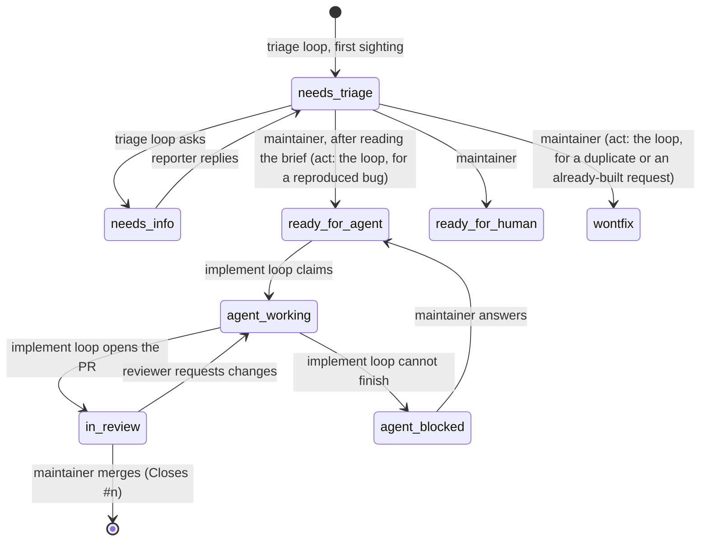

# Recipes: a project run on loops, installed in one command

A **recipe** is a packaged way of running a project on loops: one or more jobs, the **playbook**
each of them reads on every run, a **manifest** that says what to create, and sometimes a setup
script. `/recipe add <name>` installs one into the project you have open; what you get is exactly
what you could have made by hand with `cp` and `/cron add`, which is the point — a recipe cannot do
anything a person could not have typed.

```text
/recipe                    what is packaged, and what is installed here
/recipe show issue-loop    the files, the jobs, the levels, the setup script
/recipe add issue-loop     install it: a question, a confirmation, done
/recipe update issue-loop  merge a newer pi-loops' playbooks into your copies
/recipe remove issue-loop  its jobs go; the files stay unless you say --purge
```

Eight recipes ship, and the shape is meant to be copied. Three are **starters** — they read, and
file findings, and are the ones to install first; the rest are **advanced** — they write to a
worktree, a tracker or a pull request, and want their playbooks read before the level question is
answered. `/recipe list` shows them in those two groups.

| recipe | tier | jobs | what it runs | levels |
|---|---|---|---|---|
| [issue-loop](../recipes/issue-loop/) | advanced | `issue-triage` every 30 min, `issue-implement` every 30 min offset | the issue tracker as a state machine: triage into agent briefs, build accepted issues in a worktree, open pull requests | `propose`, `act` |
| [autoresearch](../recipes/autoresearch/) | advanced | `autoresearch` every hour, with `--verify` | one experiment per run against a contract you wrote, a ledger of every attempt, promotion only on held-out evidence | `propose`, `act` |
| [daily-digest](../recipes/daily-digest/) | starter | `daily-digest` at 09:00 | one finding saying what needs a look today — open items, a red CI, a loop that keeps failing — or none | `report` |
| [pr-watch](../recipes/pr-watch/) | starter | `pr-watch` every 15 min | the open pull requests, and only what changed about them: a red check, a conflict, a review waiting, an author who answered | `report`, `propose` |
| [ci-sweeper](../recipes/ci-sweeper/) | advanced | `ci-sweeper` every 15 min, 40-minute timeout | a red default branch reported, or repaired in a worktree and put up as a pull request; the same failure twice unfixed is a stop | `report`, `propose` |
| [changelog-draft](../recipes/changelog-draft/) | starter | `changelog-draft` weekdays at 18:00 | when the default branch is ahead of the last tag, the changelog entry and a version, drafted — or put in a release pull request | `report`, `propose` |
| [ecosystem](../recipes/ecosystem/) | advanced | `ecosystem` Mondays at 10:00 | who uses or forks this project, and the one reply or upstream invitation worth sending, drafted as a finding a person sends | `propose` |
| [deps-sweeper](../recipes/deps-sweeper/) | advanced | `deps-sweeper` Mondays at 08:00, 40-minute timeout | the advisories and major-version gaps not already in its notes; under `propose`, the patch and minor updates applied in a worktree, checked, and put up as one pull request | `report`, `propose` |

## What `/recipe add` does, in order

1. **Tracker first, if the recipe needs one.** issue-loop reads `docs/agents/issue-tracker.md` on
   every run to learn where the project's work items live — GitHub Issues, or one Markdown file
   per item under `.scratch/issues/` — and how to list, comment, label and close them. If the file
   is missing, the wizard hands that one step to the agent in your chat (the way `/inbox claim`
   hands over a finding): it looks at the remote, proposes, writes the file after you agree — and
   the moment that turn ends with the file in place, the wizard resumes on its own with the
   question below. Everything else is done without a model. The file's layout
   is the one Matt Pocock's engineering skills use, so a repository that has `/triage` reads the
   same description. Like the playbooks it is kept out of the repository through
   `.git/info/exclude`: it names an account and a workflow, which are the project's to keep and
   not the repository's to publish. Another clone is asked the same questions once.
2. **The autonomy level.** One question, defaulting to the lowest the recipe supports (below).
   `--level act` skips it.
3. **A name check.** A job with the same name already in `jobs.json` stops the install and says
   which recipe or `/cron add` it came from.
4. **The preflight.** What the project has and lacks for this recipe's runs, checked now and
   printed in the confirmation under *Before the first run* — reported, never enforced, so a
   missing `gh` login is a line you read tonight rather than an empty inbox tomorrow morning.
   A manifest names its checks (`needs`, and `needs_propose` for the levels that push and open
   pull requests); a recipe that reads the tracker is checked for `gh` only when
   `docs/agents/issue-tracker.md` uses it, so a local Markdown tracker asks for nothing.

   | check | what is looked at |
   |---|---|
   | `gh` | `gh` on the PATH and `gh auth status` succeeding (10 seconds, then "could not check") |
   | `git-remote` | `git remote get-url origin` |
   | `ci-workflows` | a `.yml` under `.github/workflows/` |
   | `lockfile` | one of the package managers' lockfiles at the root |
   | `tracker-github` | the tracker description names GitHub; a local one has no pull requests to watch |

   `/recipe show` runs the same checks at the recipe's highest level.
5. **The confirmation.** Every file that will be written and where, what the playbooks forbid a
   run to do (each playbook's `## Never` section, the same lines `/recipe show` prints), every
   `/cron add` line that will be run, the budget hint, the preflight. The setup script is printed into the transcript first, whole and
   as written — it will run with this session's environment, and a dialog clips what does not fit,
   so it is not put in one; a script too long to show is not run at all. A recipe installed from a path
   rather than by name is flagged as not shipped with pi-loops, with the playbooks to read first.
   Nothing has happened yet.
6. **The install.** The playbooks are copied to `.agents/skills/<recipe>/`, with an untouched copy of each
   under `.orig/` and a `.recipe.json` record (version, level, when). The directory (and the
   tracker description) is listed in `.git/info/exclude` — git's own place for a rule that belongs to one clone — so the repository
   is not touched and nothing shows in `git status`. pi discovers the copies as `/skill:` commands,
   which is how a person runs one step by hand when the loop's judgement needs checking — once the
   project is trusted: a directory that gains `.agents/skills/` is one pi asks about at its next
   start (`/trust`). The loops do not depend on that; they read the files by path.
7. **The setup script**, if any, runs once in the project (issue-loop's creates the tracker's
   labels; it is idempotent). A failure stops before any job is created and prints the output; the
   files stay in place and `/recipe add` again resumes.
8. **The jobs**, through the same code path as `/cron add`, each carrying `recipe: "<name>"` so
   `/recipe list` and `/recipe remove` can find them. Each prompt is a pointer:
   `Read .agents/skills/issue-loop/triage.md and do what it says for this repository.` The
   procedure is read fresh on every run; edit the file and the next run follows the edit.

`pi-loops recipe list|show|add` in a shell does step 6 and nothing after: the setup script and the
jobs are things a person should see before they exist, and only the pi inside `/recipe add` can show
them. It leaves the files in place and says so; `/recipe add` then finds nothing to copy.

## The autonomy level

One dial with three positions, declared per recipe in its manifest and written as the first line
of each playbook — `Autonomy: propose` — where the model reads it and a person can change it:

| level | may |
|---|---|
| `report` | read, and file findings; nothing is written outside the inbox |
| `propose` | also write to the tracker (comments, non-terminal labels) and open draft pull requests; never reach a terminal state |
| `act` | also promote, close and merge — the terminal states |

It is an instruction, not a permission. What actually holds an unattended run are the things that
were there before recipes: the [dangerous-command policy](loops.md#when-something-looks-wrong),
`[limits] daily_budget_usd`, and branch protection on the remote. Set the budget before the first
night ([loops.md](loops.md#what-it-costs-and-capping-it)); each recipe's `show` says roughly what
its default schedules cost.

## Checkpoints

A checkpoint is a finding that asks a person to decide, and at three in the morning it is read by
someone who has not seen the tracker since yesterday. So every one of them, in every packaged
playbook, says the same three things in one line: **the decision**, **what waits on it**, and
**what happens if nobody acts**.

```text
#14 brief posted — recommend ready-for-agent (bug, reproduced by npm test) · waits: the implement loop skips it until labeled · if not: stays needs-triage, no reminder
promote research/007-argpartition: dev 1.0 → 3.1, held-out 1.0 → 2.8 · waits: your merge · if not: the branch and worktree stay, later runs build on it as the best kept
CI red on main: test/web.test.ts — two fixes did not hold · waits: a person · if not: this signature is not retried
```

The third clause is the one that matters overnight. A loop that waits for an answer says so and
keeps going with everything the answer does not block; a loop that would do something on silence
(retry, re-propose when the head moves, keep building on a kept branch) says that instead, so a
person who decides to do nothing knows what nothing buys. Findings that are only news — a merged
pull request, a red check, a digest line — are not checkpoints and do not carry the clauses.

## Editing, updating, removing

The copies are yours. `/recipe update <name>` after a pi-loops upgrade is a three-way merge of the
packaged playbook against your copy with the untouched copy in `.orig/` as the base: files you never touched are
replaced silently, your edits are kept where they do not overlap the upstream change, and a file
with overlapping edits is **not written** — git's merge with markers goes to `.orig/<file>.merge`,
and the agent in your chat is handed the four paths (yours, the base, the packaged version, the
merge) to resolve with you, because conflict markers in a playbook are text the next run would follow.
A playbook installed by hand, with no untouched copy, is left alone and named.

`/recipe remove <name>` removes the recipe's jobs and keeps the files and the loops' notes;
`--purge` deletes both — of the files, only what the install wrote, since `.agents/skills/` may
hold the project's own. `/cron` shows recipe jobs like any other, and `/cron set` edits them like
any other — a recipe is how they were made, not what they are.

## Writing a recipe

A directory with a `recipe.toml`; `/recipe add ./path/to/it` installs from a directory as readily
as from the packaged set (no git URLs: a playbook is an instruction a model will follow unattended,
and should be read before it is installed).

```toml
name = "issue-loop"                 # lowercase, digits, dashes; also the install directory
summary = "one line"
tier = "advanced"                   # optional; "starter" reads and files findings, "advanced" (the default) writes somewhere
useful_when = ["one sentence"]      # optional; the situations it is for, printed by `show`
needs_tracker = true                # gate on docs/agents/issue-tracker.md
needs = ["gh", "ci-workflows"]      # optional; preflight checks at every level (gh, git-remote, ci-workflows, lockfile, tracker-github)
needs_propose = ["git-remote"]      # optional; the same, added at propose and act
levels = ["propose", "act"]         # which positions of the dial the playbooks understand
setup = "labels.sh"                 # optional; shown, then run once, before the jobs exist
files = ["RESEARCH.template.md"]    # optional; copied beside the playbooks unchanged
budget_hint_usd = 10                # optional; only a hint in `show` and the confirmation

[[job]]
name = "issue-triage"               # the /cron add --name
schedule = "*/30 * * * *"           # anything /cron add takes, except in/at (a recipe job recurs)
playbook = "triage.md"              # the file this job's runs read
timeout = "45m"                     # optional: verify, timeout, thinking, tools, prompt
```

Each `[[job]]` is checked by building the `/cron add` line it stands for and parsing it with the
same parser: a bad schedule, a `--timeout` that is not a duration, an expression that never
matches, is refused when the manifest is read, not on the first run. A playbook is Markdown with
pi's skill frontmatter (`name`, `description`) and an `Autonomy:` line the wizard will set; the
rest is what a run should do, written for a sub-agent that has only its notes, the files, and the
tools. End it with a `## Never` section: the lines under it are what `/recipe show` and the
install confirmation print as the run's safety envelope, and every packaged playbook has one. The
packaged recipes are the reference for the voice.

---

## issue-loop

The tracker becomes a state machine that two loops turn, with the two decisions that need a person
— *is this worth building?* and *is this worth merging?* — left in the inbox with everything
prepared. The state machine is Matt Pocock's `triage` skill's (five states, one category, a brief
that outlives the codebase it describes) plus three states for the implement side. Every open issue
carries one category label (`bug` | `enhancement`) and **exactly one** state label:



| state | meaning | leaves it |
|---|---|---|
| *(none)* | never looked at | the triage loop labels it `needs-triage` |
| `needs-triage` | being evaluated; a brief or questions get posted here | the triage loop (→ `needs-info`) or the maintainer (→ the three below) |
| `needs-info` | waiting on the reporter | the triage loop, once the reporter has replied |
| `ready-for-agent` | the brief is accepted; an agent may build it | the implement loop claims it |
| `ready-for-human` | judgement, access, design, manual testing | a person |
| `agent-working` | claimed: a worktree and a branch exist | the implement loop (→ `in-review` or `agent-blocked`) |
| `in-review` | a pull request is open | the maintainer merges, or a reviewer requests changes |
| `agent-blocked` | the loop stopped; its last comment says what it needs | the maintainer answers and moves it back |
| `wontfix` | closed; the reason is on the issue, and for a rejected enhancement in `.out-of-scope/` | — |

Four rules make it run unattended:

- **The tracker is the truth; a loop's notes are a cache.** Every run reads labels and comments
  fresh. Notes hold only what the tracker cannot say — the comment timestamp a run last handled,
  the worktree a run was cut off in. A person can move any issue at any time, from the web, and
  the next run sees the new state; two machines sharing a `$HOME` see the same thing.
- **The claim is the first write.** `agent-working` plus an assignee; a run that finds the label
  already gone picks the next issue. Nothing is held in memory across runs. It is a soft lock —
  the tracker has no compare-and-swap — and at thirty-minute cadence that has been enough.
- **The brief is the contract.** An *Agent Brief* comment describes behaviour, interfaces and
  acceptance criteria, never file paths or line numbers, so it is still right after the weeks it
  may wait. The implement loop builds from the latest brief; when the brief and the code disagree
  in a way the brief did not foresee, that is `agent-blocked`, not a guess.
- **Every AI comment says so** on its first line.

The two checkpoints are pushed as far right as they go. `#14 brief posted — recommend
ready-for-agent (bug, reproduced by npm test)` arrives after the loop has reproduced the bug,
checked `.out-of-scope/` and the open issues for a prior answer, and written the brief; your
click on the label is the whole approval (`act` makes that click for reproduced bugs). `#12 PR
opened — <url> (3 commits, checks green)` arrives after the build, the project's check command and
a test plan; requesting changes sends it back to the loop, which addresses each comment and
re-requests review. Merging stays with a person at every level.

What a run looks like when it goes wrong is in the playbooks themselves: a run cut off
mid-implementation resumes from its branch and notes; a check command failing twice on one issue
is a block, not a third attempt; the loop and you editing the same issue is settled by the
tracker, which wins.

With the local Markdown tracker the shape is the same and the pull request is not there: the
implement loop pushes its branch (or leaves it local), sets the item to `in-review` and files a
finding naming the branch. Requesting changes is a comment under the item's `## Comments` and the
status set back to `agent-working`; merging is `git merge` by a person, the status set to `done`
and the file moved to `closed/`. The setup script creates no labels there — it says so and exits —
and does the same when `gh` is missing or not logged in, so the install goes through and the
first run reports what it cannot do.

Specific to this repository: the labels are on
[github.com/alphacoder-v0/pi-loops](https://github.com/alphacoder-v0/pi-loops/labels), the check
command is `npm run ci`, and a release needs a one-time password — so the release side can only
propose, which is what `changelog-draft` does everywhere.

## daily-digest

One job at nine, one level. It reads the tracker, the latest run on the default branch, the last
day's commits, and the automation's own health — a loop that failed its last two runs, a finding
that has sat in the inbox for three days — and files **one** finding, the day first, then a line
per thing that needs a look. A quiet day files nothing, and a thing reported yesterday and
unchanged is not repeated: the notes carry a watermark and yesterday's lines. The loop writes
nowhere but the inbox.

## pr-watch

Every fifteen minutes, each open pull request gets one state — `green`, `red-check`, `conflict`,
`awaiting-review`, `changes-requested`, `answered` — and a finding is filed only when a state
changed since the last run, or a stall has lasted another whole day. Under `propose` the loop may
leave one comment on a pull request that has waited on the same person for more than two days,
once per stall, remembered in its notes. It never merges, approves, rebases or pushes.

## ci-sweeper

Every fifteen minutes, the latest run on the default branch. Green: nothing. Red: a **failure
signature** (job, step, first error line, normalised) is the memory — under `report` it is one
finding per signature and one more when the branch is green again; under `propose` the loop
reproduces it in a worktree, fixes the cause, runs the project's check command and opens a pull
request, and the same signature attempted twice without a green check is a stop with a finding
that says so. A test is never skipped or deleted to get to green, and the workflow file is never
edited to make it pass.

## changelog-draft

Weekdays at six, if the default branch is ahead of the last tag by anything but chores: the
changelog entry in the project's own style and a version picked the way its history picks them.
Under `report` the draft is the finding; under `propose` it is also a branch, the entry written
in, the version bumped, and a pull request whose link leads the finding — a person merges it and
tags. Tagging and publishing are never the loop's: they need a key, a one-time password and a
decision.

## ecosystem

Mondays, once. It searches for repositories that use, mention or fork this project, sorts them
into integrations, derivatives, mentions and noise, and for each integration or derivative looks
for **one** thing worth a word: a problem they hit that is fixed upstream, a fork commit worth
bringing back, an unanswered question. Each draft is a finding with the text ready to post;
claiming the finding is what sends it, as the person, from their chat. The loop itself never
posts, comments or opens anything anywhere, which is why its only level is `propose`.

## deps-sweeper

Mondays at eight. The loop finds the project's package manager from its lockfile and runs the
audit and outdated commands that manager has. The **advisory id** and the **package at a major
version** are the memory: under `report` each advisory not in the notes is one finding, each direct
dependency a whole major behind is one finding once, and a finding is repeated only when it
changes — an advisory fixed, a major that moved again. Under `propose` the loop also applies the
patch and minor updates the manager offers, in a worktree, as **one** pull request per run: the
project's check command has to be green first, a package on the playbook's deny list is never
touched, a major is never applied (it is a finding, and a person's decision), and the same package
attempted twice without a green check is a stop with a finding that says so. The lockfile is
only ever written by the package manager, never by hand. Merging stays with a person at every level.

## Another tracker

The shape Karpathy's autoresearch and Arbor made familiar, without a kernel: a **research
contract** a person writes, a **ledger** of every attempt including the failed ones, one isolated
worktree per experiment, and a rule that the held-out number decides — never the dev number a run
was tuning against.

- **`RESEARCH.md`** at the project root is the contract: objective, metric and direction, the dev
  and held-out commands (each prints `metric=<number>`), which files may change, which are
  protected, the promotion rule, the time budget. The loop never writes it; a run that finds it
  missing files one finding and stops, and a run that finds a protected file's hash changed does
  the same. `RESEARCH.template.md` is installed beside the playbook; `example/` is a filled-in one
  with a naive exact k-NN in pure Python whose baseline speedup is 1.0.
- **`results.tsv`** (the path the contract names) is the ledger: one row per experiment with its
  branch, hypothesis, dev and held-out numbers and a status — `baseline`, `running`, `retired`,
  `kept`, `promoted`. A retired row is negative evidence the next run reads before choosing; the
  loop writes the file and never commits it.
- **One run, one experiment.** Choose a hypothesis the ledger has not retired, write its row as
  `running`, branch in a worktree, change only the editable files, commit, measure on dev. Not
  better: `retired`, worktree removed, branch deleted, no finding — a retired experiment is the
  normal outcome and the row is what matters. Better on dev: measure on held-out; a dev-only gain
  is `retired` too, with that note.
- **A streak of retired rows is the ledger's own checkpoint.** Five in a row since the last kept
  row files one finding asking whether the contract's directions, metric or budget are wrong, and
  the loop keeps going only in idea classes it has not tried; ten in a row stops the loop until
  `RESEARCH.md` changes (its hash is in the notes). An hourly loop in the wrong search space is the
  expensive failure, and the person who wrote the contract is the one who can fix it.
- **Promotion** is the checkpoint. Under `propose` the finding names the branch and both numbers
  and a person merges; under `act` the loop merges into the checkout's current branch and the
  finding says so. The job runs with `--verify`, and the playbook's *For the checker* section tells
  the checker what verifying means here: check out the branch, run the held-out command yourself,
  keep the finding only if your number satisfies the rule.

Try it on the example before your own problem:

```sh
cp -r .agents/skills/autoresearch/example /tmp/knn && cd /tmp/knn && git init -q && git add -A && git commit -qm baseline
pi                      # /recipe add autoresearch, then /cron run autoresearch
```

The first run measures the baseline and creates the ledger; each later one tries one idea. With
the example's five-percent rule and a four-second evaluation, a promotion arrives within a few
runs — and so do the retired ideas, in the ledger, which is what makes the runs after that better.
